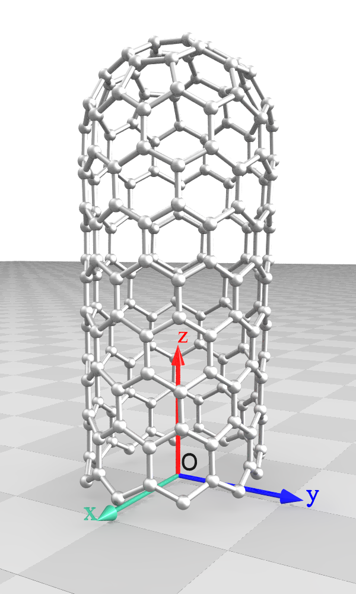
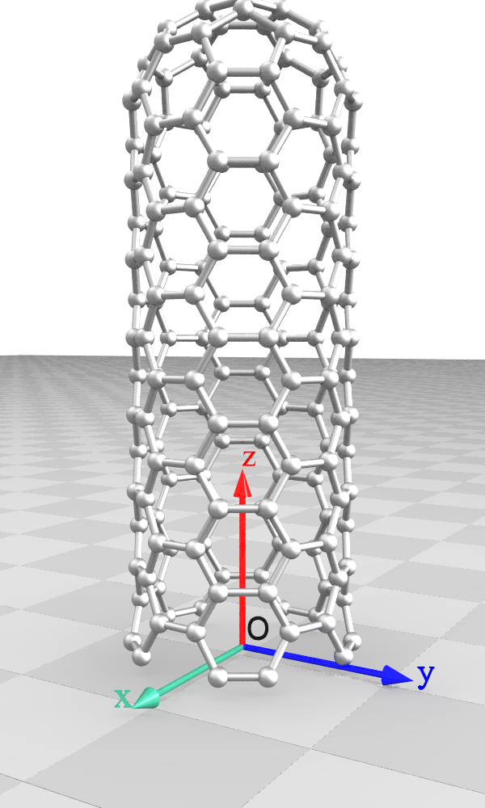
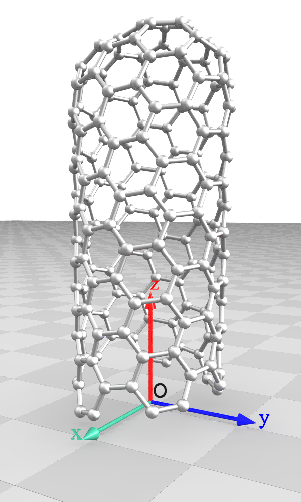

# Graphene-Topology Library v0.1

Copyright (c) 2024–2025 Zhengrong Guo.

---

Graphene-Topology is a C++ library for generating graphene-derived nanostructures, such as caped carbon nanotubes, with future support planned for fullerenes, nanotube heterojunctions and nanotube–graphene heterojunctions. This library simplifies the modeling of complex structures that have traditionally been difficult to construct, providing a valuable tool for researchers in the field. The underlying methodology is based on the topological theory of graphene-based structures, as detailed in the paper:  
**A Topological Sum Rule for the Chirality of Carbon Nanotubes**.

## Distribution Contents

The Graphene-Topology package includes the following files and directories:

- `README` – Main documentation file  
- `Makefile` – Build file for compiling the project  
- `CMakeLists.txt` – CMake build configuration file  
- `examples/` – Example input scripts for generating common-seen carbon nanotubes  
- `include/` – Library header files  
- `src/` – Source code files

## Build Instructions

**Requirements:**  
- C++20 or above

**Dependencies:**  
- No external dependencies

**Platforms:**  
- **Linux:** Run `make` to generate the executable directly.  
- **macOS:** May require modifying the `Makefile` or generating a new one via CMake.  
- **Windows:** Build by configuring the CMake project.

After successful compilation, the executable `grapology` will be generated.

Notice:

- Graphene-Topology is a header-only, open-source library (all files in ./include directory). The grapology executable serves as a lightweight wrapper around it (see ./src/main.cpp for details). We encourage researchers to use the library directly in their own projects for greater flexibility and control.

<div style="page-break-after: always;"></div>

## Basic Usage

```bash
executable script -optional

#e.g. ./grapology ./examples/8_8_IPR.dat -mol2
```
   script: Input script file containing the carbon cap configuration (seen description section for details). 

   optional: Supported options include:
   - `mol2`    : Outputs MOL2 file (default).
   - `xyz`     : Outputs XYZ file.
   - `pdb`     : Outputs PDB file.
   - `poscar`  : Outputs POSCAR file.
   - `povray`  : Outputs POV-Ray script for 3D visualization.
   - `lammps`  : Outputs LAMMPS data file for molecular simulation.
   - `lammpstrj`: Outputs LAMMPS trajectory file for molecular visualization.
   - `optimize`: Enables additional structural optimization after default processing.
   - `none`    : Disables default output file generation.

## Library Description

A carbon cap for a carbon nanotube is a structural motif formed by six pentagons situated amidst a variable number of hexagons. The underlying topological theory, as detailed in "A Topological Sum Rule for the Chirality of Carbon Nanotubes", posits that the cap's configuration can be completely described by the placement of its six pentagons across six sub-vector spaces {<b>*r*</b><sub>i</sub><sup>n</sup>, <b>*r*</b><sub>i</sub><sup>m</sup>}, i &rarr N{1,2,3,4,5,6} (shown below). Consequently, the chirality of the cap is defined (or described) by a corresponding set of 12 integers, denoted as <strong>\[(*n*<sub>1</sub>,*m*<sub>1</sub>),(*n*<sub>2</sub>,*m*<sub>2</sub>),(*n*<sub>3</sub>,*m*<sub>3</sub>),(*n*<sub>4</sub>,*m*<sub>4</sub>),(*n*<sub>5</sub>,*m*<sub>5</sub>),(*n*<sub>6</sub>,*m*<sub>6</sub>)\]</strong>. These indices directly determine the the resulting carbon nanotube chirality (<b>*n*</b>,<b>*m*</b>), where <b>*n*</b> and <b>*m*</b> are given by the sum :

<div style="font-weight: bold; font-style: italic;">
<b>n</b> = n<sub>1</sub>+n<sub>2</sub>+n<sub>3</sub>+n<sub>4</sub>+n<sub>5</sub>+n<sub>6</sub>,
</div>

<div style="font-weight: bold; font-style: italic;">
<b>m</b> = m<sub>1</sub>+m<sub>2</sub>+m<sub>3</sub>+m<sub>4</sub>+m<sub>5</sub>+m<sub>6</sub>*
</div>


This finding allows for the generation of a carbon nanotube with any given chiral indices. Furthermore, all possible caps for a specific nanotube can be enumerated by identifying combinations of numbers with a fixed sum.

<div> 
 

Figure 0. Carbon cap formation process. Left top: the six vector spaces to define each pentagon. Bottom: four examples of carbon cap formation. Right Top: the resulting carbon nanotube chiral indices.
</div>

The executable simply reads the chiral indices (12 intergers) of the cap along with a 13th integer parameter from the script. The 13th value controls the number of additional hexagons added to the compact cap structural motif, directly determining the final length of the resulting carbon nanotube. Each line in the input script file should contain exactly 13 integers separated by spaces, as demonstrated in the example below. 

```bash
 1 0 2 0 1 0 2 0 1 0 2 0 100 # comment:  [(1,0),(2,0),(1,0),(2,0),(1,0),(2,0)]-100h - (9,0)
 0 0 1 1 1 1 1 1 1 1 1 1 100 # comment:  [(0,0),(1,1),(1,1),(1,1),(1,1),(1,1)]-100h - (5,5)
 1 1 1 1 1 1 1 1 1 1 1 1 100 # comment:  [(1,1),(1,1),(1,1),(1,1),(1,1),(1,1)]-100h - (6,6)
 1 0 1 1 1 1 2 1 2 0 2 0 100 # comment:  [(1,0),(1,1),(1,1),(2,1),(2,0),(2,0)]-100h - (9,3)
 2 1 2 1 2 1 2 1 3 0 3 0 100 # comment:  [(2,1),(2,1),(2,1),(2,1),(3,0),(3,0)]-100h - (14,4)
 1 0 2 0 3 1 2 1 1 0 5 2 100 # comment:  [(1,0),(2,0),(3,1),(2,1),(1,0),(5,2)]-100h - (14,4)
```

See the ./examples/ directory for more examples.

The generated nanotube is oriented along the z-axis, with the closed end facing the positive z-direction and the open edge positioned at z=0, as illustrated below:

<div> 
 
 
 

Figure 1. Generated carbon nanotube's orientation. CNT Chiral indices are (9,0), (5,5), (9,3), respectively.
</div>
   
## Citation
If you use this library in your research, please cite:

"A Topological Sum Rule for the Chirality of Carbon Nanotubes", Zhengrong Guo, ... (2025, In submission)

## Acknowledgments

This work was supported by the National Natural Science Foundation of China (NSFC No. 12462009).
